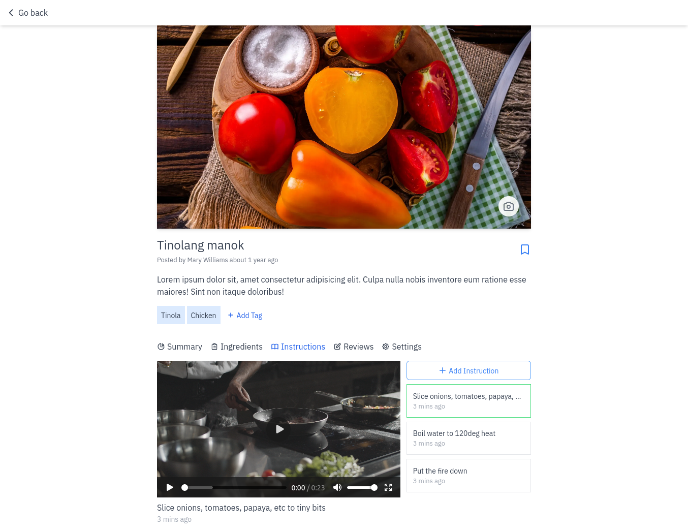

## Recipes

Share or find amazing recipes



**Requirements**

- mongo 5.\*
- nodejs 16.\*
- yarn

**Installation**

- clone repo
- open repo and rename `.env.example` to `.env`
- open terminal and cd to repo
- run the command below

```
yarn
npx prisma db push
yarn dev
```
