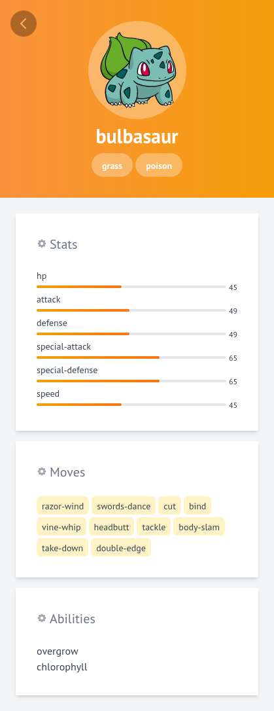

## POKEDEX

All your lovely little pokemon characters



**Requirements**

- node 16.\*
- yarn

**Installation**

- Clone repo
- Open repo and rename `.env.example` to `.env.local`
- Open terminal, cd to repo and run the command below

```
yarn
yarn dev
```

---

powered by [pokeapi](https://pokeapi.co/)
